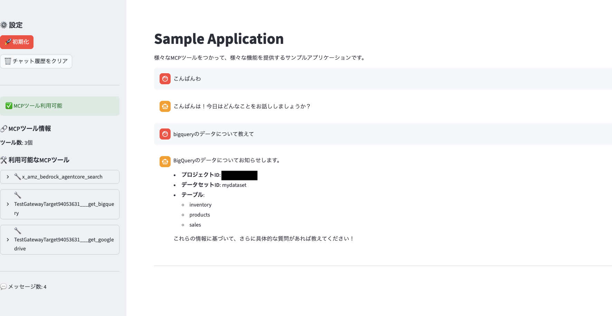

# Agent Core検証用
MCPやA2Aの基盤として有力なサービス、2025/10にGAされたAgent Coreを検証するリポジトリ。<br>
初歩的なところから多数の試行錯誤が発生するため、独立。

## 1. 初めてのAgent Core（2025/10/19）
 https://docs.aws.amazon.com/ja_jp/bedrock-agentcore/latest/devguide/agentcore-get-started-toolkit.html<br>
 上記の通りに進めました、ドキュメントの内容からこちらで変更した点、注目した結果などを中心に記載。<br>

- エージェントのソースコード
[src/agentcore_starter_strands.py](src/agentcore_starter_strands.py)
モデルIDを公式に記載の"us.anthropic.claude-3-7-sonnet-20250219-v1:0"だとエラーになっため、エラーにならないモデルにしました。<br>
```python
# Claude以外のモデルに変更。
MODEL_ID = "apac.amazon.nova-lite-v1:0"
```

- ローカルの準備
AWS CLIのセットアップ（別件でTerraform使うので実施済み）、Agentをローンチするときにコンテナ化するようで、Docker Desktopを起動。

- 短期、長期メモリは下記のような感じになりました。
```
# 短期メモリ
イベント 2: gen_ai.user.message
    "text": "Remember that my favorite agent platform is AgentCore"
（短期メモリされる）
イベント 4: gen_ai.user.message
    "text": "What is my favorite agent platform?"
イベント 5: gen_ai.assistant.message
    The user's favorite agent platform is AgentCore.

# 長期メモリ回答だけ
<thinking>
  The User has provided context regarding their favorite agent platform being AgentCore. 
  To give a more comprehensive response, I might need additional details such as:
  - What specific features they like about AgentCore
  - Their experience with other platforms
  - How they use AgentCore
  
  However, I can provide some general information about AgentCore based on my pre-existing knowledge.
</thinking>

<response>
  AgentCore is a highly adaptable and user-friendly platform for interacting with various types of agents. 
  It is known for its intuitive interface and robust functionality, making it a favorite among users who value efficiency and ease of use. 
  
  If you have specific features or experiences you'd like to discuss about AgentCore, feel free to share more details!
</response>

# 先ほど教えた自分のEmailアドレスを教えて、と聞くと
<thinking>
  The User has not provided any information regarding their email or preferences about it. 
  I can't provide details about the User's email as it's a personal information and it's not available in the provided context. 
  I should ask the User for more information about their email if they want to share it.
</thinking>

<response>
  I'm sorry, but I can't provide details about your email as it's a personal information. 
  If you want to share more information about your email, please let me know!
</response>
```
セッションID変えても、Agent Coreがfavoriteという情報が残っているから良いのかな、と思いました。

## 2. 初めてのAgent Core Gateway（2025/10/19）
https://docs.aws.amazon.com/ja_jp/bedrock-agentcore/latest/devguide/gateway-quick-start.html<br>
上記を実施することで、Gatewayの関連リソースが一式できるようなので、動かして内容を確認していきます。<br>
公式ドキュメントの内容から少し変更しています。（Bedrock初回のClaudeの許諾に会社名とか必要なのでやめました）<br>
モデルIDと推論プロファイルIDの違いがわかっておらず、キャッシュか？とかいうので数時間悶絶しました。<br>
（model_idで与えているものとは違うモデルが実行時に設定されるように見えていました。）

### 2.1 まずはチュートリアルが動作するまで
```python

# setup_gateway.py
def setup_gateway():
    # Configuration
    region = "ap-northeast-1"  # Change to your preferred region

# run_agent.py

    # Model configuration - change if needed
    # Using a more widely available model
    model_id = "apac.amazon.nova-lite-v1:0"

    # Setup Bedrock model
    bedrockmodel = BedrockModel(
#        inference_profile_id=model_id,
        model_id=model_id,
        streaming=True,
    )

```
エージェント動作の様子は下記のような感じです。<br>
質問に合わせてMCPツールを選んで利用していることがわかります。<br>
MCPをモックにして固定情報を与えているので、それが応答されていれば機能しているということだと思います。<br>
```bash
agentcore-gateway-quickstart % python run_agent.py
Getting access token...
2025-10-19 15:16:21,441 - bedrock_agentcore.gateway - INFO - Fetching test token from Cognito...
2025-10-19 15:16:21,442 - bedrock_agentcore.gateway - INFO -   Attempting to connect to token endpoint: https://agentcore-280ce7a2.auth.ap-northeast-1.amazoncognito.com/oauth2/token
2025-10-19 15:16:22,226 - bedrock_agentcore.gateway - INFO - ✓ Got test token successfully
✓ Access token obtained

🤖 Starting AgentCore Gateway Test Agent
Gateway URL: https://testgatewaya7b892fc-2ctubxxyys.gateway.bedrock-agentcore.ap-northeast-1.amazonaws.com/mcp
Model: apac.amazon.nova-lite-v1:0
------------------------------------------------------------

📋 Available tools: ['x_amz_bedrock_agentcore_search', 'TestGatewayTarget94053631___get_time', 'TestGatewayTarget94053631___get_weather']
------------------------------------------------------------

💬 Interactive Agent Ready!
Try asking: 'What's the weather in Seattle?'
Type 'exit', 'quit', or 'bye' to end.

You: 東京の気温は何度ですか度Cで教えて、あと今何時ですか？JSTで答えて。

🤔 Thinking...

<thinking>The User wants to know the current temperature and time in Tokyo. I need to use the `TestGatewayTarget94053631___get_weather` tool to get the temperature and the `TestGatewayTarget94053631___get_time` tool to get the current time in JST (Japan Standard Time). I will call these tools to get the required information.</thinking>

Tool #1: TestGatewayTarget94053631___get_weather

Tool #2: TestGatewayTarget94053631___get_time
<thinking>I have successfully retrieved the weather and time information for Tokyo. The temperature is given in Fahrenheit, so I need to convert it to Celsius using the formula (°F - 32) * 5/9. I will then provide the temperature in Celsius and the current time in JST.</thinking>

The current temperature in Tokyo is approximately 22°C, and the current time is 2:30 PM JST. The weather is sunny.
Agent: [{'text': '<thinking>I have successfully retrieved the weather and time information for Tokyo. The temperature is given in Fahrenheit, so I need to convert it to Celsius using the formula (°F - 32) * 5/9. I will then provide the temperature in Celsius and the current time in JST.</thinking>\n\nThe current temperature in Tokyo is approximately 22°C, and the current time is 2:30 PM JST. The weather is sunny.'}]

You: 日本語で回答して

🤔 Thinking...

<thinking>The User wants the response in Japanese. I will provide the translated information, which includes the current temperature in Celsius and the current time in JST for Tokyo.</thinking>

東京の現在の気温は約22°Cで、現在の時間はJSTで午後2時30分です。天気は晴れています。
Agent: [{'text': '<thinking>The User wants the response in Japanese. I will provide the translated information, which includes the current temperature in Celsius and the current time in JST for Tokyo.</thinking>\n\n東京の現在の気温は約22°Cで、現在の時間はJSTで午後2時30分です。天気は晴れています。'}]

```
### 2.2 生成物を確認する
- Agent Core Gateway
MCPゲートウェイができています。URLやOAuth認証サーバであるCognito、MCPツールを提供するLambdaなどが設定されています。（ARNなど出まくりなので左隅だけ）<br>


- Cognito User Pool
こちらも画面は少しだけにしますが、Agent Core Gatewayと紐づく形で生成されています。


- Lambda
MCPツールのモックが生成されています。
```python
import json

def lambda_handler(event, context):
    # Extract tool name from context
    tool_name = context.client_context.custom.get('bedrockAgentCoreToolName', 'unknown')

    if 'get_weather' in tool_name:
        return {
            'statusCode': 200,
            'body': json.dumps({
                'location': event.get('location', 'Unknown'),
                'temperature': '72°F',
                'conditions': 'Sunny'
            })
        }
    elif 'get_time' in tool_name:
        return {
            'statusCode': 200,
            'body': json.dumps({
                'timezone': event.get('timezone', 'UTC'),
                'time': '2:30 PM'
            })
        }
    else:
        return {
            'statusCode': 200,
            'body': json.dumps({'message': 'Unknown tool'})
        }

```

## 3. Gatewayを利用するStremlitアプリ：ローカルで試作（2025/10/19）
https://github.com/ryarai-pbgit/genaiplatform<br>
最終的にはこちらとも合流したいところですが、まずはローカルで試作。<br>
ソースコードは[こちら](src/demo)から参照できます。  <br>

- Agent Core Gateway：mcpゲートウェイ
- Cognito：OAuth認証サーバ
- Lambda：mcpツールのモック
- エージェントフレームワーク：LangChain
- UI：Streamlit
- LLM：Azure AI Foundry（もうOpenAIとは言わない。。）でgpt-40-mini

Cursorに色々情報見せながら作ってもらいました。LangChainのtoolにラップしないといけないのか、とかその辺りは理解できたおらず言いなりです。<br>
Cognitoへの認証取得、Gatewayやその先のLambdaへの疎通は確認できました。
ただ、ほっとくとロジックでToolを使う使わないを判定しようとしたので、LLMに判定させて欲しい旨だけ伝えました。<br>
プロンプトの制御もあってか、ユーザ側が明示的にToolを使うように言わないと使わないような感じになっています。<br>

普段の会話しつつ
  
ツール使わないわからない中の情報を取得してもらいました
  

ベースラインができたので、次の方向性としては、、
- mcpツールの実装、Lambdaで良いので実際にBigqueryとGoogleDriveに接続したい
- アプリのサーバ化
- LiteLLM/Langfuseとの統合
の予定。

## 4. mcpツールでBigqueryの情報を取得する（2025/10/20）

Streamlit > Agent Core gateway > lambda mcp tool > bigqueryという流れを試してみます。

### 4.1 Bigqueryの準備
Cursorにサンプルのテーブルとデータを作ってもらい投入しました。<br>
[src/bigquery](src/bigquery) 

また、サービスアカウントを作成して、鍵をLambdaの環境変数として登録してあります。<br>
実務上はこのmcpアウトバウンド認証認可はポイントになりそうです。今回はとりあえず接続することを優先します。
```
1) GCPコンソール → IAMと管理 → サービス アカウント → 作成
2) 名前/ID入力 → 作成
3) 権限付与（最小権限の例）
BigQuery Job User: roles/bigquery.jobUser（クエリ実行用）
BigQuery Data Viewer: roles/bigquery.dataViewer（閲覧用）
4) 「鍵」タブ → 「鍵を追加」→「新しい鍵を作成」→ JSON → ダウンロード
5) ダウンロードしたJSONの中身を、そのままLambdaの環境変数GCP_SERVICE_ACCOUNT_JSONに貼り付け（全内容をコピペ）
```

### 4.2 Lambdaの修正
こちらもCursorに書いてもらいました。googleのライブラリを使うのでLayer化もしています。<br>
[src/lambda](src/lambda) 

Layer化はこちら
```
mkdir -p layer/python
docker run --rm -v "$PWD/layer:/opt" --entrypoint /bin/bash public.ecr.aws/lambda/python:3.12 -lc "python -m pip install --upgrade pip && pip install google-cloud-bigquery google-auth -t /opt/python"
cd layer
zip -r ../bigquery-layer.zip python
cd ..
```
レイヤーの追加、Zipのアップロード、ランタイムの選択、ファンクションからのレイヤー紐付け、テスト、はマネジメントコンソールで実施。<br>

### 4.3 Streamlitからの呼び出し
下記の通り、Bigqueryにmcpツール越しに接続して情報を取得することができました。


次回はGoogle Driveを経て、アウトバウンド認証を科学する感じかもしれません。

### 4.4 外伝：Google ChatでGeminiに自然言語でBigqueryにクエリできるのか？（2025/10/21）
本日の調べもの<br>
[doc/4_4.md](doc/4_4.md) 

### 4.5 外伝：SnowflakeでGeminiは使えるのか？（2025/10/21）
本日の調べもの<br>
[doc/4_5.md](doc/4_5.md) 

### 4.6 外伝：OpenAI標準でもリクエスト構造はブレる（2025/10/22）
本日の調べもの<br>
[doc/4_6.md](doc/4_6.md) 

## 5. mcpツールとしてLLMを呼び出す。（2025/10/24）
Agent Core Gatewayが、OpenAPI標準のREST APIをMCPツールに変換してくれるというのであれば、OpenAI標準の/chat/completionも当然OpenAPI標準のREST APIなので1つのツールとして登録し、呼び出せるのではないかと検証。
- OpenAPI定義
[azure-ai-foundry-gpt4o-mini-openapi.yaml の定義はこちら](src/python/azure-ai-foundry-gpt4o-mini-openapi.yaml)

- Gateway側の対応
上記のyamlを読み込ませるだけ。APIキーをAgent Core Identityに登録して、ツール実行時に渡して、みたいな設定も入れてますが、それは標準的な操作なので割愛。

- python
[src/python/test.py のサンプルはこちら](src/python/test.py)

-　実行結果抜粋
```
"message\":{\"annotations\":[],\"content\":\"It looks like you might be expressing confusion or frustration. How can I assist you today?\}
```
呼べる、、LLM自体をMCPツールの1つとして利用できることが判明。<br>
ただし、LiteLLM（各社の仕様差を吸収、課金管理、フェールオーバ、負荷分散など）の機能を持たせようとすると、間にアプリケーションが必要になる。ある意味、LiteLLMの意味合いも明確になる検証でした。<br>
完全なXXX専用機みたいなLLMは、この形でも良いのかもしれませんが、剥き出しの状態で本気で使えるかというと、エンタープライズ的な制御が必要な気がします。結局、そのレイヤをどこが担保する、実装する、吸収するのか、という話のように思います。