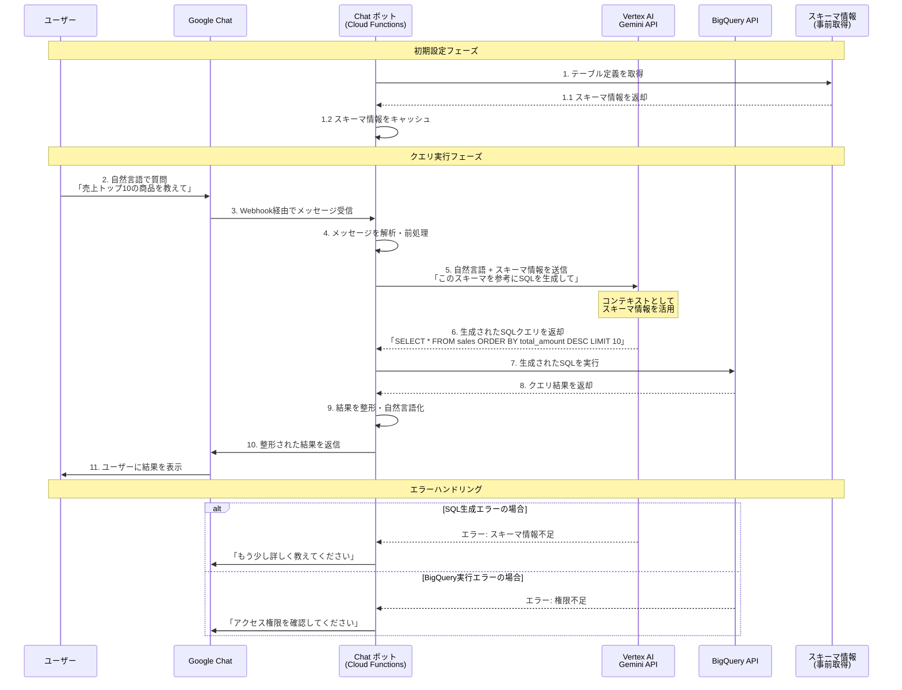

# 4.4 外伝：Google ChatでGeminiに自然言語でBigqueryにクエリできるのか？

Gemini氏に聞いてみたところ、下記のような感じに。
```
Google Chat の Gemini がユーザーの BigQuery データベースに直接アクセスし、中身を見ながら自然言語でクエリを実行する標準機能は、現時点では提供されていません。

Gemini がチャット上であなたの BigQuery のテーブル定義（スキーマ）やデータ、アクセス権限を自動的に認識することはできないためです。

ただし、実現する方法は2つあります。

解決策1：Gemini in BigQuery を利用する（最も簡単）
もし「Google Chat 上で」という条件が必須でなければ、BigQuery の管理画面（コンソール）内で直接 Gemini を使うのが最も簡単な方法です。これは「Gemini in BigQuery」という機能です。

機能： BigQuery の SQL エディタ内で、自然言語（日本語OK）で指示を出すと、Gemini がテーブル定義を自動で理解し、SQL クエリを生成・補完してくれます。

使い方：

BigQuery の SQL ワークスペースを開きます。

--（コメント）に続けて「（テーブル名）から（条件）でデータを取得して」のように日本語で指示を書くか、専用の入力欄を使います。

Gemini が自動で SQL を生成します。

解決策2：カスタムの Google Chat ボットを開発する（上級者向け）
ユーザーがリクエストした「Google Chat で BigQuery にクエリしたい」を文字通り実現するには、開発者がカスタムの Chat ボットを作成する必要があります。

これは、Google Chat、Gemini API、BigQuery API を連携させる中〜上級者向けの開発です。

必要な手順
Google Chat ボットの作成： Google Apps Script や Cloud Functions を使い、Chat からのメッセージを受け取るボットを作成します。

Gemini API との連携： ボットが受け取った自然言語のメッセージを Vertex AI Gemini API に送信します。

重要： この時、あらかじめ BigQuery のテーブル定義（スキーマ情報）をテキストとして取得し、Gemini API に「このスキーマを参考にして」という**コンテキスト（背景情報）**として一緒に渡す必要があります。これが「BigQuery を見せる」という部分に該当します。

SQL の生成： Gemini API は、受け取った自然言語とスキーマ情報をもとに、実行可能な SQL クエリを生成してボットに返します。

BigQuery API との連携： ボットは、生成された SQL を BigQuery API を使って実行し、結果を取得します。

Chat への返信： ボットは、BigQuery から得られた結果を整形し、Google Chat にメッセージとして返信します。

まとめ
今すぐ簡単に試したい場合： Gemini in BigQuery（BigQuery の画面内）を使ってください。

どうしても Google Chat 上で実現したい場合： カスタムの Chat ボットを開発する必要があります。

```
解決策２については、同じGoogle内といえど、mcp的なものが間に入るようです。<br>
しかし、彼らはあまりmcpという単語を積極的に使わないような気がします。

mcpとは直接的に書いていないですが、１でスキーマを取得して５でGemini渡す流れがmcpそのものです。<br>
スキーマ情報を取得するだけであれば、mcpである必要もないかもしれませんが、情報ソースや用途が増えてくる都度、個別の独自開発で膨れていきます。<br>
なので、結局はgoogleのサービス内で閉じる場合でも、mcpは必要になってくる感じです。